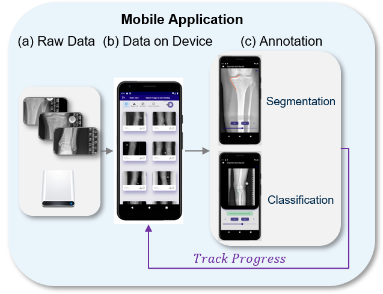

# MediAnnotate
> A Comprehensive Solution for Rapid Medical Dataset Annotation and Deep Learning Model Development. Can be analyzed by the [MediAnnotateEvaluator application](https://github.com/NikonPic/MediAnnotateEvaluator).

  

## Getting Started

*Install the Application on your mobile device*

Upload the private annotation data:

**For Android:**
`data -> Android -> com.example.fastseg`

## Annotate the Images

Select the classes and segmentations:

## Export the Annotations

**For Android:**
`data -> Android -> com.example.fastseg`

Provides the datasets for each user 
